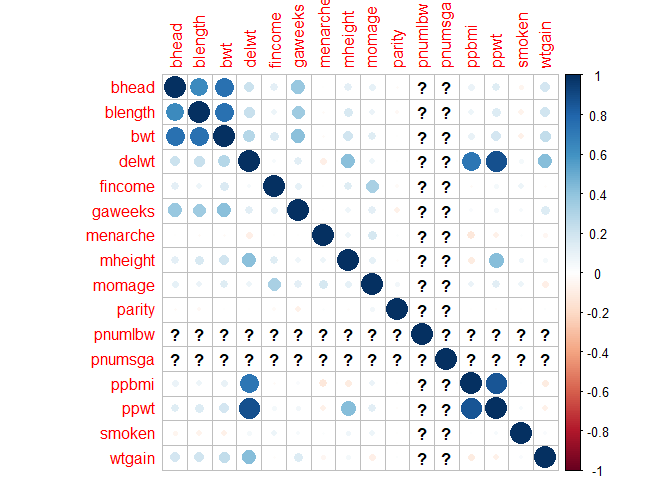
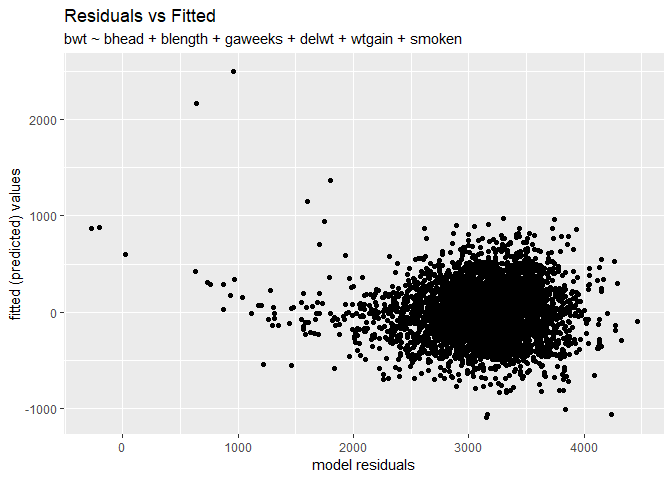

hw6\_p8105\_jld2227
================
James Dalgleish
November 20, 2018

instruction: Create a city\_state variable (e.g. “Baltimore, MD”), and a binary variable indicating whether the homicide is solved. Omit cities Dallas, TX; Phoenix, AZ; and Kansas City, MO – these don’t report victim race. Also omit Tulsa, AL – this is a data entry mistake. Modifiy victim\_race to have categories white and non-white, with white as the reference category. Be sure that victim\_age is numeric.

``` r
homicide_data <- read_csv("https://raw.githubusercontent.com/washingtonpost/data-homicides/master/homicide-data.csv") %>% #read in data.
  mutate( victim_first = iconv(x = victim_first, from = "latin1", to =  "ASCII",sub = ""), #fixes bad characters in victim name
          victim_last = iconv(x = victim_last, from = "latin1", to =  "ASCII",sub = ""),
          victim_age = as.numeric(victim_age), #converts victim age to numeric.
          victim_race = ifelse(victim_race == "White","white","non-white") %>% #binarizes the categories to white or nonwhite, depending on if the race is "White" or not.
            as.factor() %>% #converts to factor
            forcats::fct_relevel("white","non_white"), #sets reference cat to white
          #This removes nonstandard characters that cause problems with skimr.
          city_state = str_c(city,", ",state), #create city state variable by string concatenation.
          unresolved = disposition %in% c("Closed without arrest","Open/No arrest"),
          #creates a variable for whether the case was  unresolved.
          resolved = disposition %in% c("Closed by arrest")) %>% 
#creates a variable for whether the case was resolved, to double check the numbers.
#Included the resolved cases as a separate variable to clearly show that the resolved and unresolved cases sum to the total (and hence the calculations make sense).
  filter(!(city_state %in% c("Dallas, TX","Phoenix, AZ","Kansas City, MO","Tulsa, AL")))
```

    ## Parsed with column specification:
    ## cols(
    ##   uid = col_character(),
    ##   reported_date = col_integer(),
    ##   victim_last = col_character(),
    ##   victim_first = col_character(),
    ##   victim_race = col_character(),
    ##   victim_age = col_character(),
    ##   victim_sex = col_character(),
    ##   city = col_character(),
    ##   state = col_character(),
    ##   lat = col_double(),
    ##   lon = col_double(),
    ##   disposition = col_character()
    ## )

    ## Warning in evalq(as.numeric(victim_age), <environment>): NAs introduced by
    ## coercion

    ## Warning: Unknown levels in `f`: non_white

For the city of Baltimore, MD, use the glm function to fit a logistic regression with resolved vs unresolved as the outcome and victim age, sex and race (as just defined) as predictors. Save the output of glm as an R object; apply the broom::tidy to this object; and obtain the estimate and confidence interval of the adjusted odds ratio for solving homicides comparing non-white victims to white victims keeping all other variables fixed.

``` r
balt_hom_fit <- homicide_data %>%
   filter(city_state == "Baltimore, MD") %$%
  glm(resolved ~ victim_age + victim_sex + victim_race,
      family = binomial())
balt_city_ci_or <- balt_hom_fit %>%
  broom::tidy(conf.int=TRUE) %>%
  mutate(OR = exp(estimate))
balt_city_ci_or %>% 
  knitr::kable()
```

| term                    |      estimate|     std.error|     statistic|       p.value|       conf.low|      conf.high|                                                                                                                                                                                                                                    OR|
|:------------------------|-------------:|-------------:|-------------:|-------------:|--------------:|--------------:|-------------------------------------------------------------------------------------------------------------------------------------------------------------------------------------------------------------------------------------:|
| (Intercept)             |     1.1860305|     0.2346173|      5.055170|     0.0000004|      0.7304353|      1.6510016|                                                                                                                                                                                                                             3.2740589|
| victim\_age             |    -0.0069900|     0.0032627|     -2.142423|     0.0321594|     -0.0134243|     -0.0006274|                                                                                                                                                                                                                             0.9930344|
| victim\_sexMale         |    -0.8877869|     0.1360573|     -6.525097|     0.0000000|     -1.1557600|     -0.6218669|                                                                                                                                                                                                                             0.4115656|
| victim\_racenon-white   |    -0.8195997|     0.1746156|     -4.693738|     0.0000027|     -1.1642313|     -0.4785693|                                                                                                                                                                                                                             0.4406080|
| Now run glm for each of |  the cities i|  n your datas|  et, and extr|  act the adju|  sted odds rat|  io (and CI) f|  or solving homicides comparing non-white victims to white victims. Do this within a “tidy” pipeline, making use of purrr::map, list columns, and unnest as necessary to create a dataframe with estimated ORs and CIs for each city.|

``` r
all_city_glm <- homicide_data %>%
  group_by(city_state)  %>%
  nest() %>% 
  mutate(hom_glm = map(data,~glm(formula = resolved ~ victim_age + victim_sex + victim_race,data=.x,family = binomial()))) %>% 
         mutate(hom_tidy = map(hom_glm,broom::tidy,conf.int=TRUE))  %>% 
  select(-data,-hom_glm) %>% 
  unnest() %>% 
  mutate(OR = exp(estimate)) %>% 
  filter(term == "victim_racenon-white")
all_city_glm %>% 
 knitr::kable()  
```

| city\_state        | term                  |    estimate|  std.error|   statistic|    p.value|    conf.low|   conf.high|         OR|
|:-------------------|:----------------------|-----------:|----------:|-----------:|----------:|-----------:|-----------:|----------:|
| Albuquerque, NM    | victim\_racenon-white |  -0.2991208|  0.2533324|  -1.1807442|  0.2377043|  -0.7998866|   0.1949547|  0.7414698|
| Atlanta, GA        | victim\_racenon-white |  -0.2839530|  0.2839388|  -1.0000499|  0.3172864|  -0.8570126|   0.2616373|  0.7528020|
| Baltimore, MD      | victim\_racenon-white |  -0.8195997|  0.1746156|  -4.6937375|  0.0000027|  -1.1642313|  -0.4785693|  0.4406080|
| Baton Rouge, LA    | victim\_racenon-white |  -0.4040228|  0.3869122|  -1.0442234|  0.2963820|  -1.1895103|   0.3402853|  0.6676289|
| Birmingham, AL     | victim\_racenon-white |   0.0385265|  0.2676433|   0.1439473|  0.8855421|  -0.4915428|   0.5617564|  1.0392783|
| Boston, MA         | victim\_racenon-white |  -2.1667164|  0.4528769|  -4.7843384|  0.0000017|  -3.1580592|  -1.3527987|  0.1145531|
| Buffalo, NY        | victim\_racenon-white |  -0.9418961|  0.3090454|  -3.0477600|  0.0023055|  -1.5604371|  -0.3426671|  0.3898879|
| Charlotte, NC      | victim\_racenon-white |  -0.5842897|  0.2819768|  -2.0721197|  0.0382543|  -1.1612289|  -0.0506017|  0.5575017|
| Chicago, IL        | victim\_racenon-white |  -0.5761032|  0.1353253|  -4.2571744|  0.0000207|  -0.8398954|  -0.3088704|  0.5620844|
| Cincinnati, OH     | victim\_racenon-white |  -1.1445849|  0.2797127|  -4.0920021|  0.0000428|  -1.7152585|  -0.6137709|  0.3183560|
| Columbus, OH       | victim\_racenon-white |  -0.1570014|  0.1524111|  -1.0301179|  0.3029547|  -0.4558142|   0.1421471|  0.8547029|
| Denver, CO         | victim\_racenon-white |  -0.5076856|  0.2636768|  -1.9254089|  0.0541782|  -1.0283171|   0.0076239|  0.6018870|
| Detroit, MI        | victim\_racenon-white |  -0.4288684|  0.1474623|  -2.9083264|  0.0036337|  -0.7186628|  -0.1398934|  0.6512456|
| Durham, NC         | victim\_racenon-white |   0.0028136|  0.4637170|   0.0060674|  0.9951589|  -0.9409428|   0.8968513|  1.0028175|
| Fort Worth, TX     | victim\_racenon-white |  -0.1769334|  0.2105823|  -0.8402101|  0.4007906|  -0.5927841|   0.2339812|  0.8378356|
| Fresno, CA         | victim\_racenon-white |  -0.8034052|  0.3385915|  -2.3727864|  0.0176545|  -1.5035693|  -0.1667521|  0.4478015|
| Houston, TX        | victim\_racenon-white |  -0.1362727|  0.1134097|  -1.2015963|  0.2295200|  -0.3589178|   0.0859265|  0.8726047|
| Indianapolis, IN   | victim\_racenon-white |  -0.6840764|  0.1422436|  -4.8091876|  0.0000015|  -0.9655445|  -0.4075222|  0.5045560|
| Jacksonville, FL   | victim\_racenon-white |  -0.4182842|  0.1378746|  -3.0338019|  0.0024149|  -0.6895683|  -0.1487648|  0.6581751|
| Las Vegas, NV      | victim\_racenon-white |  -0.2804869|  0.1291909|  -2.1711042|  0.0299233|  -0.5350815|  -0.0283884|  0.7554159|
| Long Beach, CA     | victim\_racenon-white |  -0.2307939|  0.3657381|  -0.6310361|  0.5280169|  -0.9700906|   0.4734625|  0.7939031|
| Los Angeles, CA    | victim\_racenon-white |  -0.4067023|  0.1639568|  -2.4805456|  0.0131181|  -0.7314138|  -0.0877406|  0.6658424|
| Louisville, KY     | victim\_racenon-white |  -0.9367139|  0.2113709|  -4.4316135|  0.0000094|  -1.3577945|  -0.5278011|  0.3919136|
| Memphis, TN        | victim\_racenon-white |  -0.2454925|  0.2046512|  -1.1995656|  0.2303081|  -0.6555142|   0.1485108|  0.7823191|
| Miami, FL          | victim\_racenon-white |  -0.5512363|  0.2161364|  -2.5504093|  0.0107597|  -0.9749939|  -0.1265724|  0.5762370|
| Milwaukee, wI      | victim\_racenon-white |  -0.4582502|  0.2293869|  -1.9977176|  0.0457473|  -0.9205624|  -0.0185884|  0.6323892|
| Minneapolis, MN    | victim\_racenon-white |  -0.4374158|  0.3201857|  -1.3661318|  0.1718976|  -1.0760500|   0.1856473|  0.6457029|
| Nashville, TN      | victim\_racenon-white |  -0.1069270|  0.1625919|  -0.6576403|  0.5107693|  -0.4276932|   0.2101967|  0.8985913|
| New Orleans, LA    | victim\_racenon-white |  -0.7637119|  0.2336816|  -3.2681734|  0.0010824|  -1.2237188|  -0.3049161|  0.4659337|
| New York, NY       | victim\_racenon-white |  -0.6321289|  0.3281302|  -1.9264575|  0.0540473|  -1.3070716|  -0.0117878|  0.5314592|
| Oakland, CA        | victim\_racenon-white |  -1.5465668|  0.3639485|  -4.2494107|  0.0000214|  -2.3134722|  -0.8718251|  0.2129779|
| Oklahoma City, OK  | victim\_racenon-white |  -0.3838211|  0.1807515|  -2.1234741|  0.0337141|  -0.7400546|  -0.0307718|  0.6812533|
| Omaha, NE          | victim\_racenon-white |  -1.7783134|  0.3017037|  -5.8942373|  0.0000000|  -2.4001120|  -1.2108021|  0.1689228|
| Philadelphia, PA   | victim\_racenon-white |  -0.4403262|  0.1432184|  -3.0745086|  0.0021085|  -0.7245890|  -0.1624782|  0.6438263|
| Pittsburgh, PA     | victim\_racenon-white |  -1.2674074|  0.2859816|  -4.4317796|  0.0000093|  -1.8499156|  -0.7231089|  0.2815606|
| Richmond, VA       | victim\_racenon-white |  -0.8042697|  0.5193311|  -1.5486646|  0.1214624|  -1.9363574|   0.1398570|  0.4474146|
| San Antonio, TX    | victim\_racenon-white |  -0.3720067|  0.2049269|  -1.8153143|  0.0694756|  -0.7796165|   0.0252778|  0.6893496|
| Sacramento, CA     | victim\_racenon-white |  -0.2475177|  0.2826726|  -0.8756338|  0.3812291|  -0.8138098|   0.2983580|  0.7807364|
| Savannah, GA       | victim\_racenon-white |  -0.5168361|  0.3857230|  -1.3399154|  0.1802729|  -1.2918943|   0.2294484|  0.5964045|
| San Bernardino, CA | victim\_racenon-white |  -0.1276678|  0.4115855|  -0.3101853|  0.7564200|  -0.9322843|   0.6927296|  0.8801457|
| San Diego, CA      | victim\_racenon-white |  -0.7270019|  0.2474030|  -2.9385335|  0.0032977|  -1.2228297|  -0.2506027|  0.4833560|
| San Francisco, CA  | victim\_racenon-white |  -0.7802724|  0.2326787|  -3.3534325|  0.0007982|  -1.2447014|  -0.3300767|  0.4582812|
| St. Louis, MO      | victim\_racenon-white |  -0.5498302|  0.1794573|  -3.0638500|  0.0021851|  -0.9048665|  -0.2001116|  0.5770478|
| Stockton, CA       | victim\_racenon-white |  -0.9789109|  0.3309013|  -2.9583172|  0.0030932|  -1.6432662|  -0.3386870|  0.3757201|
| Tampa, FL          | victim\_racenon-white |   0.1474076|  0.3469750|   0.4248363|  0.6709560|  -0.5363722|   0.8298157|  1.1588262|
| Tulsa, OK          | victim\_racenon-white |  -0.5067195|  0.1925320|  -2.6318712|  0.0084916|  -0.8885143|  -0.1328309|  0.6024687|
| Washington, DC     | victim\_racenon-white |  -0.6731847|  0.3483463|  -1.9325159|  0.0532959|  -1.3874454|  -0.0107690|  0.5100815|

Create a plot that shows the estimated ORs and CIs for each city. Organize cities according to estimated OR, and comment on the plot.

``` r
all_city_glm %>% 
  mutate(city_state = forcats::fct_reorder(city_state,OR)) %>% 
  ggplot(data = .,
  aes(x = city_state, y = estimate, ymin = conf.low, ymax = conf.high)) +
  geom_point() +
  geom_errorbar() +
  theme(axis.text.x = element_text(angle = 270)) +
  labs(x = "City, State",
       title = "Odds Ratio Estimate, White-Nonwhite for unresolved cases",
       y = "Odds Ratio")
```

 Load and clean the data for regression analysis (i.e. convert numeric to factor where appropriate, check for missing data, etc.).

``` r
birthweight <- read_csv("http://p8105.com/data/birthweight.csv", col_types = "cnnnnncnlnnncnnnnnnn") %>%
  mutate(babysex = as.factor(babysex)) %>% 
  mutate(babysex = recode(babysex, `1` = 'male', `2` = 'female'))  %>% 
  janitor::clean_names() %>% 
  mutate(frace = as.factor(frace)) %>% 
  mutate(malform = as.factor(malform)) %>% 
  mutate(mrace = as.factor(mrace))
```

Instruction: Propose a regression model for birthweight. This model may be based on a hypothesized structure for the factors that underly birthweight, on a data-driven model-building process, or a combination of the two.

Describe your modeling process and show a plot of model residuals against fitted values – use add\_predictions and add\_residuals in making this plot.

Perhaps the best way to build a model is with some user input based on hypothesis to begin with. Factors that do not affect birthweight significantly or have small effect sizes can be removed. We should do this with some sense of the distribution of the data (whether some variables are skewed in distribution or normal) and the linear relataionships between variables in the dataset to each other (correlations).

Our initial, hypothesis based model will include physical attributes of the newborn, including the length of the infant and the circumference of the head, as well as the age of the child at birth (in gestational weeks) as full-term infants are larger than premature ones. A priori, we would think that the number of low birth weight babies that each mother had would be helpful, but as we'll see, no one sampled had any low weight children prior to this study and it's a useless variable in this particular dataset.

Here's our initial model, including the terms previously stated. We'll note that the number of low weight children for each mother of the individual children in the study simply drops out of the model.

``` r
initreg <- birthweight %>%
  glm(data = ., bwt ~ bhead + blength + gaweeks + pnumlbw)
initreg %>% 
  broom::glance()
```

    ## # A tibble: 1 x 7
    ##   null.deviance df.null  logLik    AIC    BIC   deviance df.residual
    ##           <dbl>   <int>   <dbl>  <dbl>  <dbl>      <dbl>       <int>
    ## 1   1138652193.    4341 -30719. 61449. 61481. 355164031.        4338

Why it dropped out of the model becomes clear in the summaries below. pnumlbw ("previous number of low birth weight babies") and pnumsga ("number of prior small for gestational age babies") are zero from minimum to maximum. They should not be included in the model.

``` r
skimr::skim_with(numeric = list(hist = NULL, min = min, max = max, kurtosis = e1071::kurtosis, skewness = e1071::skewness, IQR = IQR,
mean = mean,
cv = function(x){sd(x)/mean(x)})) #specifies that skimr should summarize additional variables (e.g. IQR, etc).
skimr::skim(birthweight) %>% 
  skimr::kable() 
```

    ## Skim summary statistics  
    ##  n obs: 4342    
    ##  n variables: 20    
    ## 
    ## Variable type: factor
    ## 
    ##  variable    missing    complete     n      n_unique              top_counts               ordered 
    ## ----------  ---------  ----------  ------  ----------  ---------------------------------  ---------
    ##  babysex        0         4342      4342       2          mal: 2230, fem: 2112, NA: 0       FALSE  
    ##   frace         0         4342      4342       5        1: 2123, 2: 1911, 4: 248, 3: 46     FALSE  
    ##  malform        0         4342      4342       2           FAL: 4327, TRU: 15, NA: 0        FALSE  
    ##   mrace         0         4342      4342       4        1: 2147, 2: 1909, 4: 243, 3: 43     FALSE  
    ## 
    ## Variable type: numeric
    ## 
    ##  variable    missing    complete     n       mean       sd       p0       p25      p50       p75     p100     min     max     kurtosis    skewness    IQR      cv   
    ## ----------  ---------  ----------  ------  --------  --------  -------  -------  --------  -------  ------  -------  ------  ----------  ----------  ------  -------
    ##   bhead         0         4342      4342    33.65      1.62      21       33        34       35       41      21       41       4.45       -1.01       2      0.048 
    ##  blength        0         4342      4342    49.75      2.72      20       48        50       51       63      20       63       7.04       -1.17       3      0.055 
    ##    bwt          0         4342      4342    3114.4    512.15     595     2807     3132.5    3459     4791     595     4791      1.35       -0.49      652     0.16  
    ##   delwt         0         4342      4342    145.57    22.21      86       131      143       157     334      86      334       3.72        1.2        26     0.15  
    ##  fincome        0         4342      4342    44.11     25.98       0       25        35       65       96       0       96      -0.64        0.61       40     0.59  
    ##  gaweeks        0         4342      4342    39.43      3.15     17.7     38.3      39.9     41.1     51.3    17.7     51.3      5.92       -1.44      2.8     0.08  
    ##  menarche       0         4342      4342    12.51      1.48       0       12        12       13       19       0       19       1.58        0.12       1      0.12  
    ##  mheight        0         4342      4342    63.49      2.66      48       62        63       65       77      48       77       1.12       -0.19       3      0.042 
    ##   momage        0         4342      4342     20.3      3.88      12       18        20       22       44      12       44       3.43        1.3        4      0.19  
    ##   parity        0         4342      4342    0.0023     0.1        0        0        0         0       6        0       6      2821.55      51.49       0      44.69 
    ##  pnumlbw        0         4342      4342      0         0         0        0        0         0       0        0       0        NaN         NaN        0       NaN  
    ##  pnumsga        0         4342      4342      0         0         0        0        0         0       0        0       0        NaN         NaN        0       NaN  
    ##   ppbmi         0         4342      4342    21.57      3.18     13.07    19.53    21.03     22.91    46.1    13.07    46.1      4.96        1.59      3.38    0.15  
    ##    ppwt         0         4342      4342    123.49    20.16      70       110      120       134     287      70      287       5.18        1.49       24     0.16  
    ##   smoken        0         4342      4342     4.15      7.41       0        0        0         5       60       0       60       5.38        2.22       5      1.79  
    ##   wtgain        0         4342      4342    22.08     10.94      -46      15        22       28       89      -46      89       2.74        0.43       13      0.5

We also note that there is some mild skewness, but only extreme in the parity variable ("number of live births prior to this pregnancy").

``` r
#GGally::ggpairs(birthweight)

  dplyr::select_if(.tbl = birthweight,.predicate = is.numeric)  %>% 
  cor() %>% 
corrplot::corrplot()
```

    ## Warning in cor(.): the standard deviation is zero

 We could also produce a list of variables and their sorted correlations with the predictor. Doing so reveals that delwt (delivery weight) and weight gain (wtgain) might be added to the model as they have some of the strongest relationships with the predictor.

``` r
dplyr::select_if(.tbl = birthweight,.predicate = is.numeric)  %>% 
  cor() %>% 
  as.data.frame() %>% 
    add_rownames() %>% 
  as.tibble() %>% 
  select(rowname,bwt) %>% 
  arrange(-bwt)
```

    ## Warning in cor(.): the standard deviation is zero

    ## Warning: Deprecated, use tibble::rownames_to_column() instead.

    ## # A tibble: 16 x 2
    ##    rowname        bwt
    ##    <chr>        <dbl>
    ##  1 bwt        1      
    ##  2 bhead      0.747  
    ##  3 blength    0.743  
    ##  4 gaweeks    0.412  
    ##  5 delwt      0.288  
    ##  6 wtgain     0.247  
    ##  7 mheight    0.192  
    ##  8 ppwt       0.183  
    ##  9 fincome    0.155  
    ## 10 momage     0.136  
    ## 11 ppbmi      0.0939 
    ## 12 parity    -0.00837
    ## 13 menarche  -0.0244 
    ## 14 smoken    -0.0756 
    ## 15 pnumlbw   NA      
    ## 16 pnumsga   NA

``` r
initreg_plus_2 <- birthweight %>%
  glm(data = ., bwt ~ bhead + blength + gaweeks + delwt + wtgain) 
initreg_plus_2 %>% 
  broom::glance()
```

    ## # A tibble: 1 x 7
    ##   null.deviance df.null  logLik    AIC    BIC   deviance df.residual
    ##           <dbl>   <int>   <dbl>  <dbl>  <dbl>      <dbl>       <int>
    ## 1   1138652193.    4341 -30655. 61324. 61369. 344812662.        4336

As a final step, we'll examine a full model and see if there are any variables that might be included as well, based on their effect sizes and p-values.

``` r
birthweight %>%
  glm(data = ., bwt ~ .) %>% 
  broom::tidy() %>% 
  arrange(p.value)
```

    ## # A tibble: 22 x 5
    ##    term           estimate std.error statistic   p.value
    ##    <chr>             <dbl>     <dbl>     <dbl>     <dbl>
    ##  1 bhead           131.        3.45      37.9  2.16e-271
    ##  2 blength          75.0       2.02      37.1  1.75e-261
    ##  3 delwt             4.10      0.395     10.4  5.62e- 25
    ##  4 (Intercept)   -6265.      660.        -9.49 3.81e- 21
    ##  5 smoken           -4.85      0.587     -8.27 1.78e- 16
    ##  6 gaweeks          11.5       1.47       7.88 4.06e- 15
    ##  7 babysexfemale    28.7       8.47       3.39 7.02e-  4
    ##  8 mrace2         -151.       46.0       -3.29 1.01e-  3
    ##  9 parity           95.5      40.5        2.36 1.83e-  2
    ## 10 fincome           0.290     0.180      1.61 1.07e-  1
    ## # ... with 12 more rows

'Smoken' is the average number of cigarettes per day and seems to have a definite linear relationship with the outcome variable. What's further, these findings could have important health implications given the linear relationship is fairly strong. We'll add this and compare all models discussed, along with the full and intercept only models for comparison.

``` r
smoke_model <- birthweight %>%
  glm(data = ., bwt ~ bhead + blength + gaweeks + delwt + wtgain + smoken)
full_model <- birthweight %>%
  glm(data = ., bwt ~ .) 
int_model <- birthweight %>%
  glm(data = ., bwt ~ 0) 
```

``` r
#tibble(aics = c(int_model %>% broom::glance() %>% pull(aic),full_model %>% pull(aic)))
model_tibble <- list(int_model,initreg,initreg_plus_2,smoke_model,"full" = full_model) %>% 
  map_dfr(broom::glance) %>% 
  mutate(model_name = forcats::fct_inorder(c("intercept_only","head+len+wks","+delwt+wtgain","+smoke","full"))) %>%  
  janitor::clean_names() %>% 
  select(model_name,everything())
model_tibble %>% 
  knitr::kable()
```

| model\_name      |    null\_deviance|    df\_null|     log\_lik|          aic|          bic|        deviance|                                                                                                                                                                                                               df\_residual|
|:-----------------|-----------------:|-----------:|------------:|------------:|------------:|---------------:|--------------------------------------------------------------------------------------------------------------------------------------------------------------------------------------------------------------------------:|
| intercept\_only  |       43253933446|        4342|    -41145.10|     82292.20|     82298.57|     43253933446|                                                                                                                                                                                                                       4342|
| head+len+wks     |        1138652193|        4341|    -30719.38|     61448.77|     61480.65|       355164031|                                                                                                                                                                                                                       4338|
| +delwt+wtgain    |        1138652193|        4341|    -30655.17|     61324.34|     61368.97|       344812662|                                                                                                                                                                                                                       4336|
| +smoke           |        1138652193|        4341|    -30647.33|     61310.67|     61361.67|       343570458|                                                                                                                                                                                                                       4335|
| full             |        1138652193|        4341|    -30497.95|     61041.89|     61188.54|       320724338|                                                                                                                                                                                                                       4320|
| As we'll notice, |  all the models h|  ave an AIC|  that is MUC|  H lower tha|  n the inter|  cept, suggesti|  ng our variables are indeed better than random. We'll plot every model except for the intercept below, finding that although the model we ended with is great, it is not as optimal as the model including all variables.|

``` r
library(ggrepel)
model_tibble %>%
  filter(model_name != "intercept_only") %>% 
  ggplot(aes(x=model_name, y = aic)) + 
  geom_point(aes(fill=log_lik)) +
  geom_line() + 
  geom_text_repel(aes(label = aic)) +
  scale_y_log10() +
  labs(x = "Model", y = "AIC value, log scale", title = "Birthweight Models")
```

    ## geom_path: Each group consists of only one observation. Do you need to
    ## adjust the group aesthetic?


Instruction: Describe your modeling process and show a plot of model residuals against fitted values – use add\_predictions and add\_residuals in making this plot.

``` r
birthweight %>% 
lm(data = ., bwt ~ bhead + blength + gaweeks + delwt + wtgain + smoken) %>% 
  modelr::add_predictions(data = birthweight, model=.) %>% 
  modelr::add_residuals(data = ., model=smoke_model) %>% 
  ggplot(aes(x = pred,y = resid)) +
  geom_point() +
  labs(x = "model residuals",
       y = "fitted (predicted) values",
       title = "Residuals vs Fitted",
       subtitle = "bwt ~ bhead + blength + gaweeks + delwt + wtgain + smoken")
```

 From the plot, we can see that there is some slight fanning in the low residual values due to some outliers in the data, but otherwise, the residuals seem to be evenly distributed about zero. Compare your model to two others:

One using length at birth and gestational age as predictors (main effects only) One using head circumference, length, sex, and all interactions (including the three-way interaction) between these Make this comparison in terms of the cross-validated prediction error; use crossv\_mc and functions in purrr as appropriate.

Instruction: Note that although we expect your model to be reasonable, model building itself is not a main idea of the course and we don’t necessarily expect your model to be “optimal”.

``` r
length_age_mod <- birthweight %>% 
  glm(data = ., bwt ~ blength + gaweeks )
head_len_sex_mod <- birthweight %>% 
  glm(data = ., bwt ~ bhead*blength*babysex )
set.seed(1)
birthweight %>% 
  modelr::crossv_mc(100) %>% 
  mutate(train = map(train, as_tibble),
         test = map(test, as_tibble)) %>% 
  mutate(length_age_mod = map(train, ~lm(bwt ~ blength + gaweeks, data = .x)),
         head_len_sex_mod = map(train, ~lm(bwt ~ bhead*blength*babysex, data = .x)),
         smoke_mod = map(train, ~lm(bwt ~ bhead + blength + gaweeks + delwt + wtgain + smoken, data = .x))) %>% 
  mutate(rmse_la    = map2_dbl(length_age_mod, test, ~rmse(model = .x, data = .y)),
         rmse_hls = map2_dbl(head_len_sex_mod, test, ~rmse(model = .x, data = .y)),
         rmse_smoke = map2_dbl(smoke_mod, test, ~rmse(model = .x, data = .y))) %>% 
  select(starts_with("rmse")) %>% 
  gather(key = model, value = rmse) %>% 
  ggplot(aes(x = model, y = rmse, color = model)) +
geom_violin() +
geom_point() +
  labs(x = "model",
       y = "Root Mean Squared Error", 
       title = "Distribution of RMSE values in 100 fold Cross Validation, by model")
```


