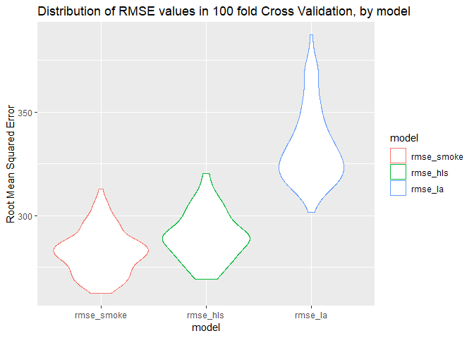

hw6\_p8105\_jld2227
================
James Dalgleish
November 20, 2018

Instruction: Create a city\_state variable (e.g. “Baltimore, MD”), and a binary variable indicating whether the homicide is solved. Omit cities Dallas, TX; Phoenix, AZ; and Kansas City, MO – these don’t report victim race. Also omit Tulsa, AL – this is a data entry mistake.Modifiy victim\_race to have categories white and non-white, with white as the reference category. Be sure that victim\_age is numeric.

In this dataset, we'll look at the odds ratios of homicide victims by city and deduce, which cities have the highest risk of homicide for non-white victims as compared with white victims, with confidence intervals to get a sense of the plausible values of the odds ratio.

To begin with, we'll pull the homicide data directly from the washington post github site, remove the odd looking characters from the data with iconv, convert age to numeric, change the victim race to a white-nonwhite only factor, and change this factor to have white as the reference category. We'll also create a city\_state variable by combining city and state, identify which cases are unresolved (not closed by arrest). For a bit of a sanity check (to make sure numbers add up), we'll also add a variable for resolved cases. As such, the total cases should make up the resolved and unresolved cases, and they do. We'll also remove the non-existent city, Tulsa, AL, and Dallas, Phoenix, and Kansas City.

``` r
homicide_data <- read_csv("https://raw.githubusercontent.com/washingtonpost/data-homicides/master/homicide-data.csv") %>% 
  mutate( victim_first = iconv(x = victim_first, from = "latin1", to =  "ASCII",sub = ""),            victim_last = iconv(x = victim_last, from = "latin1", to =  "ASCII",sub = ""),
          victim_age = as.numeric(victim_age), 
          victim_race = ifelse(victim_race == "White","white","non-white") %>% 
          as.factor() %>% 
          forcats::fct_relevel("white","non_white"), 
          city_state = str_c(city,", ",state), 
          unresolved = disposition %in% c("Closed without arrest","Open/No arrest"),
          resolved = disposition %in% c("Closed by arrest")) %>% 
  filter(!(city_state %in% 
  c("Dallas, TX","Phoenix, AZ","Kansas City, MO","Tulsa, AL")))

homicide_data %>% 
  head() %>% 
  knitr::kable()
```

| uid        |  reported\_date| victim\_last | victim\_first | victim\_race |  victim\_age| victim\_sex | city        | state |       lat|        lon| disposition           | city\_state     | unresolved | resolved |
|:-----------|---------------:|:-------------|:--------------|:-------------|------------:|:------------|:------------|:------|---------:|----------:|:----------------------|:----------------|:-----------|:---------|
| Alb-000001 |        20100504| GARCIA       | JUAN          | non-white    |           78| Male        | Albuquerque | NM    |  35.09579|  -106.5386| Closed without arrest | Albuquerque, NM | TRUE       | FALSE    |
| Alb-000002 |        20100216| MONTOYA      | CAMERON       | non-white    |           17| Male        | Albuquerque | NM    |  35.05681|  -106.7153| Closed by arrest      | Albuquerque, NM | FALSE      | TRUE     |
| Alb-000003 |        20100601| SATTERFIELD  | VIVIANA       | white        |           15| Female      | Albuquerque | NM    |  35.08609|  -106.6956| Closed without arrest | Albuquerque, NM | TRUE       | FALSE    |
| Alb-000004 |        20100101| MENDIOLA     | CARLOS        | non-white    |           32| Male        | Albuquerque | NM    |  35.07849|  -106.5561| Closed by arrest      | Albuquerque, NM | FALSE      | TRUE     |
| Alb-000005 |        20100102| MULA         | VIVIAN        | white        |           72| Female      | Albuquerque | NM    |  35.13036|  -106.5810| Closed without arrest | Albuquerque, NM | TRUE       | FALSE    |
| Alb-000006 |        20100126| BOOK         | GERALDINE     | white        |           91| Female      | Albuquerque | NM    |  35.15111|  -106.5378| Open/No arrest        | Albuquerque, NM | TRUE       | FALSE    |

Instruction: For the city of Baltimore, MD, use the glm function to fit a logistic regression with resolved vs unresolved as the outcome and victim age, sex and race (as just defined) as predictors. Save the output of glm as an R object; apply the broom::tidy to this object; and obtain the estimate and confidence interval of the adjusted odds ratio for solving homicides comparing non-white victims to white victims keeping all other variables fixed.

Now, we'll focus on Baltimore. We'll do this by filtering for cases only from baltimore, fitting a logistic regression model for resolved cases with age, sex, and race of the victim as predictors, then create confidence intervals using broom::tidy and odds ratios by calculating *O**R* = *e*<sup>*e**s**t**i**m**a**t**e*</sup> and doing the same to the lower and upper bound of that same estimate.

``` r
balt_hom_fit <- homicide_data %>%
   filter(city_state == "Baltimore, MD") %$%
  glm(resolved ~ victim_age + victim_sex + victim_race,
      family = binomial())
balt_city_ci_or <- balt_hom_fit %>%
  broom::tidy(conf.int=TRUE) %>%
  mutate(OR = exp(estimate), OR_conf.low = exp(conf.low), OR_conf.high = exp(conf.high))
balt_city_ci_or %>% 
  knitr::kable()
```

| term                    |       estimate|   std.error|     statistic|       p.value|       conf.low|      conf.high|           OR|    OR\_conf.low|                                                                                                                                                                                                            OR\_conf.high|
|:------------------------|--------------:|-----------:|-------------:|-------------:|--------------:|--------------:|------------:|---------------:|------------------------------------------------------------------------------------------------------------------------------------------------------------------------------------------------------------------------:|
| (Intercept)             |      1.1860305|   0.2346173|      5.055170|     0.0000004|      0.7304353|      1.6510016|    3.2740589|       2.0759841|                                                                                                                                                                                                                5.2121977|
| victim\_age             |     -0.0069900|   0.0032627|     -2.142423|     0.0321594|     -0.0134243|     -0.0006274|    0.9930344|       0.9866654|                                                                                                                                                                                                                0.9993728|
| victim\_sexMale         |     -0.8877869|   0.1360573|     -6.525097|     0.0000000|     -1.1557600|     -0.6218669|    0.4115656|       0.3148182|                                                                                                                                                                                                                0.5369411|
| victim\_racenon-white   |     -0.8195997|   0.1746156|     -4.693738|     0.0000027|     -1.1642313|     -0.4785693|    0.4406080|       0.3121625|                                                                                                                                                                                                                0.6196693|
| Instruction: Now run gl |  m for each of|  the cities|  in your data|  set, and ext|  ract the adju|  sted odds rat|  io (and CI)|  for solving ho|  micides comparing non-white victims to white victims. Do this within a “tidy” pipeline, making use of purrr::map, list columns, and unnest as necessary to create a dataframe with estimated ORs and CIs for each city.|

Now we'll grab the odds ratios for resolved white to nonwhite for all cities, not just baltimore. We'll do this by grouping by each City, State combination, nesting the individual City, State groups, then running a general linear model on the nested data (a column of tibbles), then we'll tidy the model output and produce confidence intervals. We'll remove the nested data and unused glm objects from the tibble, unnest. Utilizing the estimates, we'll calculate odds ratios again, for each city, under the same model. We'll filter these estimates for only those for the race factor (white-nonwhite) and following this, we'll display the top odds ratio city\_states.

``` r
all_city_glm <- homicide_data %>%
  group_by(city_state)  %>%
  nest() %>% 
  mutate(hom_glm = map(data,~glm(formula = resolved ~ victim_age + victim_sex + victim_race,data=.x,family = binomial()))) %>% 
         mutate(hom_tidy = map(hom_glm,broom::tidy,conf.int=TRUE))  %>% 
  select(-data,-hom_glm) %>% 
  unnest() %>% 
  mutate(OR = exp(estimate), OR_conf.low = exp(conf.low), OR_conf.high = exp(conf.high) ) %>% 
  filter(term == "victim_racenon-white")
all_city_glm %>% 
  arrange(-OR) %>% 
  head() %>% 
 knitr::kable()  
```

| city\_state        | term                  |    estimate|  std.error|   statistic|    p.value|    conf.low|  conf.high|         OR|  OR\_conf.low|  OR\_conf.high|
|:-------------------|:----------------------|-----------:|----------:|-----------:|----------:|-----------:|----------:|----------:|-------------:|--------------:|
| Tampa, FL          | victim\_racenon-white |   0.1474076|  0.3469750|   0.4248363|  0.6709560|  -0.5363722|  0.8298157|  1.1588262|     0.5848662|       2.292896|
| Birmingham, AL     | victim\_racenon-white |   0.0385265|  0.2676433|   0.1439473|  0.8855421|  -0.4915428|  0.5617564|  1.0392783|     0.6116819|       1.753750|
| Durham, NC         | victim\_racenon-white |   0.0028136|  0.4637170|   0.0060674|  0.9951589|  -0.9409428|  0.8968513|  1.0028175|     0.3902597|       2.451871|
| Nashville, TN      | victim\_racenon-white |  -0.1069270|  0.1625919|  -0.6576403|  0.5107693|  -0.4276932|  0.2101967|  0.8985913|     0.6520114|       1.233921|
| San Bernardino, CA | victim\_racenon-white |  -0.1276678|  0.4115855|  -0.3101853|  0.7564200|  -0.9322843|  0.6927296|  0.8801457|     0.3936535|       1.999165|
| Houston, TX        | victim\_racenon-white |  -0.1362727|  0.1134097|  -1.2015963|  0.2295200|  -0.3589178|  0.0859265|  0.8726047|     0.6984318|       1.089726|

Instruction: Create a plot that shows the estimated ORs and CIs for each city. Organize cities according to estimated OR, and comment on the plot.

Now, we'll visualze the ORs and CIs, sorted by the odds ratio value along the x axis. We'll first accomplish this by changing the order of the odds ratio factor, then plotting the odds ratio along with it's confidence interval.

``` r
all_city_glm %>% 
  mutate(city_state = forcats::fct_reorder(city_state,OR)) %>% 
  ggplot(data = .,
  aes(x = city_state, y = OR, ymin = OR_conf.low, ymax = OR_conf.high)) +
  geom_point() +
  geom_errorbar() +
  theme(axis.text.x = element_text(angle = 270)) +
  labs(x = "City, State",
       title = "Odds Ratio Estimate, White-Nonwhite for unresolved cases",
       y = "Odds Ratio & Confidence Interval")
```

 Instruction: Load and clean the data for regression analysis (i.e. convert numeric to factor where appropriate, check for missing data, etc.).

To create a predictive model of birthweight, which is an indicator of newborn health, we'll examine a small dataset of children with several variables recorded for them, including maternal variables such as the mother's age at menarche, female race, number of live births, as well as paternal variables. The dataset also contains physical measurements of the baby, which likely have the strongest impact on the birthweight.

We'll now read in the birthweight data, being careful to change the sex to a factor variable with "male" and "female", and we'll also make factors out of father's race, mother's race, prescnce of malformations in the child. The rest of the variables are in their appropriate form. We also note there's no missing data from the table generated below of descriptive statistics (standard skimr stats with min, max, kurtosis, skewness, IQR, mean, cv).

``` r
birthweight <- read_csv("http://p8105.com/data/birthweight.csv", col_types = "cnnnnncnlnnncnnnnnnn") %>%
  mutate(babysex = as.factor(babysex)) %>% 
  mutate(babysex = recode(babysex, `1` = 'male', `2` = 'female'))  %>% 
  janitor::clean_names() %>% 
  mutate(frace = as.factor(frace)) %>% 
  mutate(malform = as.factor(malform)) %>% 
  mutate(mrace = as.factor(mrace))
skimr::skim_with(numeric = list(hist = NULL, min = min, max = max, kurtosis = e1071::kurtosis, skewness = e1071::skewness, IQR = IQR, mean = mean,
cv = function(x){sd(x)/mean(x)})) 
  skimr::skim(birthweight)
```

    ## Skim summary statistics
    ##  n obs: 4342 
    ##  n variables: 20 
    ## 
    ## -- Variable type:factor ------------------------------------------------------------------------
    ##  variable missing complete    n n_unique                      top_counts
    ##   babysex       0     4342 4342        2     mal: 2230, fem: 2112, NA: 0
    ##     frace       0     4342 4342        5 1: 2123, 2: 1911, 4: 248, 3: 46
    ##   malform       0     4342 4342        2       FAL: 4327, TRU: 15, NA: 0
    ##     mrace       0     4342 4342        4 1: 2147, 2: 1909, 4: 243, 3: 43
    ##  ordered
    ##    FALSE
    ##    FALSE
    ##    FALSE
    ##    FALSE
    ## 
    ## -- Variable type:numeric -----------------------------------------------------------------------
    ##  variable missing complete    n      mean     sd     p0     p25     p50
    ##     bhead       0     4342 4342   33.65     1.62  21      33      34   
    ##   blength       0     4342 4342   49.75     2.72  20      48      50   
    ##       bwt       0     4342 4342 3114.4    512.15 595    2807    3132.5 
    ##     delwt       0     4342 4342  145.57    22.21  86     131     143   
    ##   fincome       0     4342 4342   44.11    25.98   0      25      35   
    ##   gaweeks       0     4342 4342   39.43     3.15  17.7    38.3    39.9 
    ##  menarche       0     4342 4342   12.51     1.48   0      12      12   
    ##   mheight       0     4342 4342   63.49     2.66  48      62      63   
    ##    momage       0     4342 4342   20.3      3.88  12      18      20   
    ##    parity       0     4342 4342    0.0023   0.1    0       0       0   
    ##   pnumlbw       0     4342 4342    0        0      0       0       0   
    ##   pnumsga       0     4342 4342    0        0      0       0       0   
    ##     ppbmi       0     4342 4342   21.57     3.18  13.07   19.53   21.03
    ##      ppwt       0     4342 4342  123.49    20.16  70     110     120   
    ##    smoken       0     4342 4342    4.15     7.41   0       0       0   
    ##    wtgain       0     4342 4342   22.08    10.94 -46      15      22   
    ##      p75   p100    min    max kurtosis skewness    IQR      cv
    ##    35      41    21      41       4.45    -1.01   2      0.048
    ##    51      63    20      63       7.04    -1.17   3      0.055
    ##  3459    4791   595    4791       1.35    -0.49 652      0.16 
    ##   157     334    86     334       3.72     1.2   26      0.15 
    ##    65      96     0      96      -0.64     0.61  40      0.59 
    ##    41.1    51.3  17.7    51.3     5.92    -1.44   2.8    0.08 
    ##    13      19     0      19       1.58     0.12   1      0.12 
    ##    65      77    48      77       1.12    -0.19   3      0.042
    ##    22      44    12      44       3.43     1.3    4      0.19 
    ##     0       6     0       6    2821.55    51.49   0     44.69 
    ##     0       0     0       0     NaN      NaN      0    NaN    
    ##     0       0     0       0     NaN      NaN      0    NaN    
    ##    22.91   46.1  13.07   46.1     4.96     1.59   3.38   0.15 
    ##   134     287    70     287       5.18     1.49  24      0.16 
    ##     5      60     0      60       5.38     2.22   5      1.79 
    ##    28      89   -46      89       2.74     0.43  13      0.5

Instruction: Propose a regression model for birthweight. This model may be based on a hypothesized structure for the factors that underly birthweight, on a data-driven model-building process, or a combination of the two. Describe your modeling process and show a plot of model residuals against fitted values – use add\_predictions and add\_residuals in making this plot.

Perhaps the best way to build a model is with some user input based on hypothesis to begin with. Factors that do not affect birthweight significantly or have small effect sizes can be removed. We should do this with some sense of the distribution of the data (whether some variables are skewed in distribution or normal) and the linear relataionships between variables in the dataset to each other (correlations).

Our initial, hypothesis based model will include physical attributes of the newborn, including the length of the infant and the circumference of the head, as well as the age of the child at birth (in gestational weeks) as full-term infants are larger than premature ones. A priori, we would think that the number of low birth weight babies that each mother had would be helpful, but as we'll see, no one sampled had any low weight children prior to this study and it's a useless variable in this particular dataset.

Here's our initial model, including the terms previously stated. We'll note that the number of low weight children for each mother of the individual children in the study simply drops out of the model.

``` r
initreg <- birthweight %>%
  glm(data = ., bwt ~ bhead + blength + gaweeks + pnumlbw)
initreg %>% 
  broom::glance() %>% 
  knitr::kable()
```

|     null.deviance|    df.null|        logLik|         AIC|          BIC|      deviance|                                                                                                                                                                                                           df.residual|
|-----------------:|----------:|-------------:|-----------:|------------:|-------------:|---------------------------------------------------------------------------------------------------------------------------------------------------------------------------------------------------------------------:|
|        1138652193|       4341|     -30719.38|    61448.77|     61480.65|     355164031|                                                                                                                                                                                                                  4338|
|  Why it dropped o|  ut of the|  model become|  s clear in|  the summari|  es below. pn|  umlbw ("previous number of low birth weight babies") and pnumsga ("number of prior small for gestational age babies") are zero from minimum to maximum. Both of these variables should not be included in the model.|

``` r
skimr::skim_with(numeric = list(hist = NULL, min = min, max = max, kurtosis = e1071::kurtosis, skewness = e1071::skewness, IQR = IQR,
mean = mean,
cv = function(x){sd(x)/mean(x)})) 
skimr::skim(birthweight) %>% 
  skimr::kable() 
```

    ## Skim summary statistics  
    ##  n obs: 4342    
    ##  n variables: 20    
    ## 
    ## Variable type: factor
    ## 
    ##  variable    missing    complete     n      n_unique              top_counts               ordered 
    ## ----------  ---------  ----------  ------  ----------  ---------------------------------  ---------
    ##  babysex        0         4342      4342       2          mal: 2230, fem: 2112, NA: 0       FALSE  
    ##   frace         0         4342      4342       5        1: 2123, 2: 1911, 4: 248, 3: 46     FALSE  
    ##  malform        0         4342      4342       2           FAL: 4327, TRU: 15, NA: 0        FALSE  
    ##   mrace         0         4342      4342       4        1: 2147, 2: 1909, 4: 243, 3: 43     FALSE  
    ## 
    ## Variable type: numeric
    ## 
    ##  variable    missing    complete     n       mean       sd       p0       p25      p50       p75     p100     min     max     kurtosis    skewness    IQR      cv   
    ## ----------  ---------  ----------  ------  --------  --------  -------  -------  --------  -------  ------  -------  ------  ----------  ----------  ------  -------
    ##   bhead         0         4342      4342    33.65      1.62      21       33        34       35       41      21       41       4.45       -1.01       2      0.048 
    ##  blength        0         4342      4342    49.75      2.72      20       48        50       51       63      20       63       7.04       -1.17       3      0.055 
    ##    bwt          0         4342      4342    3114.4    512.15     595     2807     3132.5    3459     4791     595     4791      1.35       -0.49      652     0.16  
    ##   delwt         0         4342      4342    145.57    22.21      86       131      143       157     334      86      334       3.72        1.2        26     0.15  
    ##  fincome        0         4342      4342    44.11     25.98       0       25        35       65       96       0       96      -0.64        0.61       40     0.59  
    ##  gaweeks        0         4342      4342    39.43      3.15     17.7     38.3      39.9     41.1     51.3    17.7     51.3      5.92       -1.44      2.8     0.08  
    ##  menarche       0         4342      4342    12.51      1.48       0       12        12       13       19       0       19       1.58        0.12       1      0.12  
    ##  mheight        0         4342      4342    63.49      2.66      48       62        63       65       77      48       77       1.12       -0.19       3      0.042 
    ##   momage        0         4342      4342     20.3      3.88      12       18        20       22       44      12       44       3.43        1.3        4      0.19  
    ##   parity        0         4342      4342    0.0023     0.1        0        0        0         0       6        0       6      2821.55      51.49       0      44.69 
    ##  pnumlbw        0         4342      4342      0         0         0        0        0         0       0        0       0        NaN         NaN        0       NaN  
    ##  pnumsga        0         4342      4342      0         0         0        0        0         0       0        0       0        NaN         NaN        0       NaN  
    ##   ppbmi         0         4342      4342    21.57      3.18     13.07    19.53    21.03     22.91    46.1    13.07    46.1      4.96        1.59      3.38    0.15  
    ##    ppwt         0         4342      4342    123.49    20.16      70       110      120       134     287      70      287       5.18        1.49       24     0.16  
    ##   smoken        0         4342      4342     4.15      7.41       0        0        0         5       60       0       60       5.38        2.22       5      1.79  
    ##   wtgain        0         4342      4342    22.08     10.94      -46      15        22       28       89      -46      89       2.74        0.43       13      0.5

We also note that there is some mild skewness, but only extreme in the parity variable ("number of live births prior to this pregnancy"). To do a little exploratory data analysis, we'll look at the correlations among all variables using a colored corrplot. The deleted observations have no correlation values as they are entirely columns composed of zeros.

``` r
  dplyr::select_if(.tbl = birthweight,.predicate = is.numeric)  %>% 
  cor() %>% 
corrplot::corrplot()
```

 From this, we might notice that ppbmi("mother’s pre-pregnancy BMI"), ppwt("mother’s pre-pregnancy weight (pounds)"), and delwt("mother’s weight at delivery (pounds)") are all correlated. This suggests that delwt may be less important in prediction than other variables as the delivery weight of the mother may have a lot to do with her personal weight and BMI, rather than the child she delivers. Despite this, as it turns out that delivery weight is linearly related to birth weight, although not as strongly as other variables.

To focus on variables that are linearly related to birthweight, we could also produce a list of variables and their sorted correlations with the predictor. Doing so reveals that delwt (delivery weight) and maternal weight gain (wtgain) might be added to the model as they have some of the strongest relationships with the predictor, despite having relationships with the maternal weight and bmi.

To do this, we have to select only the columns that are numeric, create a correlation tibble with the name of the correlated variables and just select the name of the variable and it's correlation with birthweight, then sort by birthweight with the largest correlations at the top.

``` r
dplyr::select_if(.tbl = birthweight,.predicate = is.numeric)  %>% 
  cor() %>% 
  as.data.frame() %>% 
    add_rownames() %>% 
  as.tibble() %>% 
  select(rowname,bwt) %>% 
  arrange(-bwt)
```

    ## # A tibble: 16 x 2
    ##    rowname        bwt
    ##    <chr>        <dbl>
    ##  1 bwt        1      
    ##  2 bhead      0.747  
    ##  3 blength    0.743  
    ##  4 gaweeks    0.412  
    ##  5 delwt      0.288  
    ##  6 wtgain     0.247  
    ##  7 mheight    0.192  
    ##  8 ppwt       0.183  
    ##  9 fincome    0.155  
    ## 10 momage     0.136  
    ## 11 ppbmi      0.0939 
    ## 12 parity    -0.00837
    ## 13 menarche  -0.0244 
    ## 14 smoken    -0.0756 
    ## 15 pnumlbw   NA      
    ## 16 pnumsga   NA

Knowing this, we'll add delivery weight and maternal weight gain to the model and see our AIC decrease a bit, suggesting an improved model.

``` r
initreg_plus_2 <- birthweight %>%
  glm(data = ., bwt ~ bhead + blength + gaweeks + delwt + wtgain) 
initreg_plus_2 %>% 
  broom::glance() %>% 
  knitr::kable()
```

|  null.deviance|  df.null|     logLik|       AIC|       BIC|   deviance|  df.residual|
|--------------:|--------:|----------:|---------:|---------:|----------:|------------:|
|     1138652193|     4341|  -30655.17|  61324.34|  61368.97|  344812662|         4336|

As a final step, we'll examine a full additive model and see if there are any variables that might be included as well, based on their effect sizes and p-values.

``` r
birthweight %>%
  glm(data = ., bwt ~ .) %>% 
  broom::tidy() %>% 
  arrange(p.value)
```

    ## # A tibble: 22 x 5
    ##    term           estimate std.error statistic   p.value
    ##    <chr>             <dbl>     <dbl>     <dbl>     <dbl>
    ##  1 bhead           131.        3.45      37.9  2.16e-271
    ##  2 blength          75.0       2.02      37.1  1.75e-261
    ##  3 delwt             4.10      0.395     10.4  5.62e- 25
    ##  4 (Intercept)   -6265.      660.        -9.49 3.81e- 21
    ##  5 smoken           -4.85      0.587     -8.27 1.78e- 16
    ##  6 gaweeks          11.5       1.47       7.88 4.06e- 15
    ##  7 babysexfemale    28.7       8.47       3.39 7.02e-  4
    ##  8 mrace2         -151.       46.0       -3.29 1.01e-  3
    ##  9 parity           95.5      40.5        2.36 1.83e-  2
    ## 10 fincome           0.290     0.180      1.61 1.07e-  1
    ## # ... with 12 more rows

'Smoken' is the average number of cigarettes per day and seems to have a definite linear relationship with the outcome variable. What's further, these findings could have important health implications given the linear relationship is fairly strong. We'll add this and compare all models discussed, along with the full and intercept only models for comparison.

``` r
smoke_model <- birthweight %>%
  glm(data = ., bwt ~ bhead + blength + gaweeks + delwt + wtgain + smoken)
full_model <- birthweight %>%
  glm(data = ., bwt ~ .) 
int_model <- birthweight %>%
  glm(data = ., bwt ~ 0) 
```

To display the model improvement through this iterative process, we'll plot the AIC for each model. We'll do this by turning the models into a list of models, performing a summary with broom::glance that will get the AIC for each model and put it into a dataframe with map\_dfr, then create a variable with the labels for the plot along the x axis, clean the names of the variables, and put the model name at the left hand side of the dataframe.

``` r
model_tibble <- list(int_model,initreg,initreg_plus_2,smoke_model,full_model) %>% 
  map_dfr(broom::glance) %>% 
  mutate(model_name = forcats::fct_inorder(c("intercept_only","head+len+wks","+delwt+wtgain","+smoke","full"))) %>%  
  janitor::clean_names() %>% 
  select(model_name,everything())
model_tibble %>% 
  knitr::kable()
```

| model\_name     |  null\_deviance|  df\_null|   log\_lik|       aic|       bic|     deviance|  df\_residual|
|:----------------|---------------:|---------:|----------:|---------:|---------:|------------:|-------------:|
| intercept\_only |     43253933446|      4342|  -41145.10|  82292.20|  82298.57|  43253933446|          4342|
| head+len+wks    |      1138652193|      4341|  -30719.38|  61448.77|  61480.65|    355164031|          4338|
| +delwt+wtgain   |      1138652193|      4341|  -30655.17|  61324.34|  61368.97|    344812662|          4336|
| +smoke          |      1138652193|      4341|  -30647.33|  61310.67|  61361.67|    343570458|          4335|
| full            |      1138652193|      4341|  -30497.95|  61041.89|  61188.54|    320724338|          4320|

As we'll notice, all the models have an AIC that is MUCH lower than the intercept, suggesting our variables are indeed better than the model with no variables other than the intercept. We'll plot every model except for the intercept below, finding that although the model we ended with is great, it is not as optimal as the model including all variables. We'll produce points and lines to show the trend, and label the points using ggrepel, which stops points from overlapping with text.

``` r
library(ggrepel)
model_tibble %>%
  filter(model_name != "intercept_only") %>% 
  ggplot(aes(x=model_name, y = aic, group = 1)) + 
  geom_point() +
  geom_line(aes(x = model_name, y =  aic)) + 
  geom_text_repel(aes(label = aic)) +
  labs(x = "Model", y = "AIC value", title = "Birthweight Models")
```


Instruction: Describe your modeling process and show a plot of model residuals against fitted values – use add\_predictions and add\_residuals in making this plot.

With our chosen model, we'll generate a diagnostic, residuals vs fitted plot. To do this, we'll use the model with the average number of cigarettes, add predictions and residuals using the modelr package, then create a scatterplot with y as the residuals and x as the predicted (fitted) value, and add appropriate titles with the labs function.

``` r
birthweight %>% 
lm(data = ., bwt ~ bhead + blength + gaweeks + delwt + wtgain + smoken) %>% 
  modelr::add_predictions(data = birthweight, model=.) %>% 
  modelr::add_residuals(data = ., model=smoke_model) %>% 
  ggplot(aes(x = pred, y = resid)) +
  geom_point() +
  labs(x = "model residuals",
       y = "fitted (predicted) values",
       title = "Residuals vs Fitted",
       subtitle = "bwt ~ bhead + blength + gaweeks + delwt + wtgain + smoken")
```

 From the plot, we can see that there is some slight fanning in the low residual values due to some outliers in the data, but otherwise, the residuals seem to be evenly distributed about zero. Instruction: Compare your model to two others: One using length at birth and gestational age as predictors (main effects only) One using head circumference, length, sex, and all interactions (including the three-way interaction) between these. Make this comparison in terms of the cross-validated prediction error; use crossv\_mc and functions in purrr as appropriate. Note that although we expect your model to be reasonable, model building itself is not a main idea of the course and we don’t necessarily expect your model to be “optimal”.

For model validation, we'll take our model and create two others for comparison. The first will feature only the length of the infant along with it's gestational age in weeks, a quantitative measure of prematurity. The second will feature all interactions and additive terms featuring infant head circumerference, infant length, and given sex of the infant.

``` r
length_age_mod <- birthweight %>% 
  glm(data = ., bwt ~ blength + gaweeks )
head_len_sex_mod <- birthweight %>% 
  glm(data = ., bwt ~ bhead*blength*babysex )
```

To do the cross validation, we'll create 100 80/20 splits of the data (resample objects) where 20% of the data is held back for testing, but which part of the data is the holdout set is randomized. For each test and train partition, we'll convert the resample objects (small datasize) to full size tibbles. On each of these, we'll run all three models and generate RMSE values, including our model with the number of cigarettes, the length/gestational weeks model, and the head circumference/length/sex interaction model. Setting the seed to 1 will allow reproducible splits for those who reknit this file. After generating the RMSEs, we'll use a select statement to get all three MSEs for all 100 test/train splits.

With the RMSEs, we'll gather the RMSEs into a single variable with another variable as an ordered factor variable for the model. Utilizing this, we'll plot the model along the x axis and the rmse along the vertical axis using violin plots to show the distribution of the RMSEs in the randomized cross-validation splits for each model. It's clear that the lowest RMSE model is the one we chose. It is not perfect, as the AIC plot showed, but it is better than the other two in terms of error. Both complex models outperform the simple model, in this case.

``` r
set.seed(1)
birthweight %>% 
  modelr::crossv_mc(n = 100) %>% 
  mutate(train = map(train, as_tibble),
         test = map(test, as_tibble)) %>% 
  mutate(length_age_mod = map(train, ~lm(bwt ~ blength + gaweeks, data = .x)),
         head_len_sex_mod = map(train, ~lm(bwt ~ bhead*blength*babysex, data = .x)),
         smoke_mod = map(train, ~lm(bwt ~ bhead + blength + gaweeks + delwt + wtgain + smoken, data = .x))) %>% 
  mutate(rmse_la    = map2_dbl(length_age_mod, test, ~rmse(model = .x, data = .y)),
         rmse_hls = map2_dbl(head_len_sex_mod, test, ~rmse(model = .x, data = .y)),
         rmse_smoke = map2_dbl(smoke_mod, test, ~rmse(model = .x, data = .y))) %>% 
  select(starts_with("rmse")) %>% 
  gather(key = model, value = rmse) %>% 
  mutate(model = as.factor(model)) %>% 
  mutate(model = fct_reorder(model,rmse)) %>% 
  ggplot(aes(x = model, y = rmse, color = model)) +
geom_violin() +
  labs(x = "model",
       y = "Root Mean Squared Error", 
       title = "Distribution of RMSE values in 100 fold Cross Validation, by model")
```


